This tutorial assumes you have already
- Read the [Pre-requisites](/tutorials/Pre-requisites)
- Downloaded the latest Forge MDK
- Setup your mod folder as described at the top of [the main Forge 1.14.4 tutorials page](/tutorials/1.14.4/forge/)
- Read and followed [1.0 - Gradle Configuration](../../1.0-gradle-configuration/)
- Chosen Eclipse from [1.1 - Importing the project into your IDE](..)

# Eclipse
1. Open up Eclipse and (if you aren't already there) switch to your "workbench".  
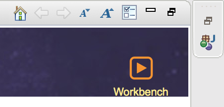  
2. Go to `File > Import > Existing Gradle Project` and import the project.

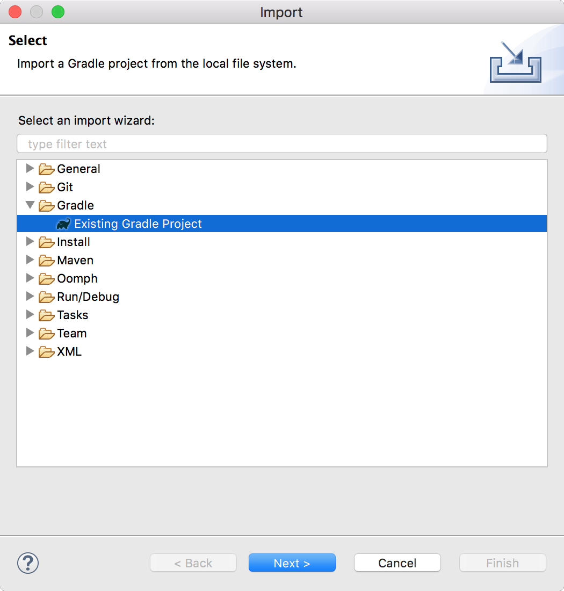

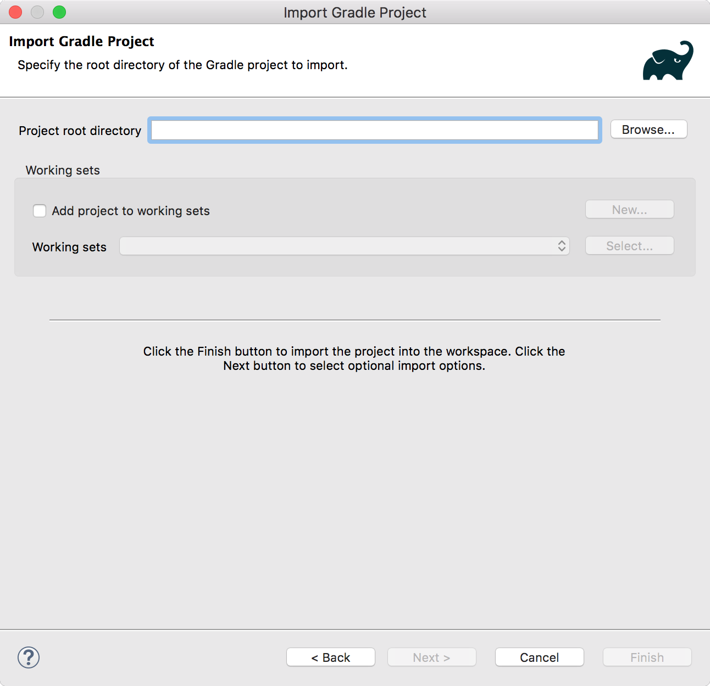  

3. Wait for the import/sync to complete  
  
  
  
4. Go to Gradle Tasks  
  
5. Run the `eclipse` task  
This will take a while as Forge downloads everything and sets up your modding environment.  
  
  
6. Run the `genEclipseRuns` task to generate the run configs to run minecraft  
  

7. Choose your run configuration  
Go to the Run Configurations menu  
  
Choose `Java Application > runClient`  
  
Open the Run menu and select the `runClient` run configuration  
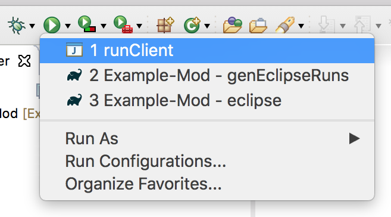  
All of these run configs launch minecraft.
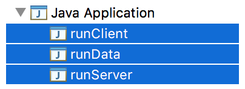  
	- `runClient` launches the minecraft client
	- `runData` launches minecraft in a special mode that only does the bare minimum required to automatically generate json files like recipes and blockstates.
	- `runServer` launches the minecraft server
8. Run the game  
  
9. Change package representation to `hierarchical` (optional)  
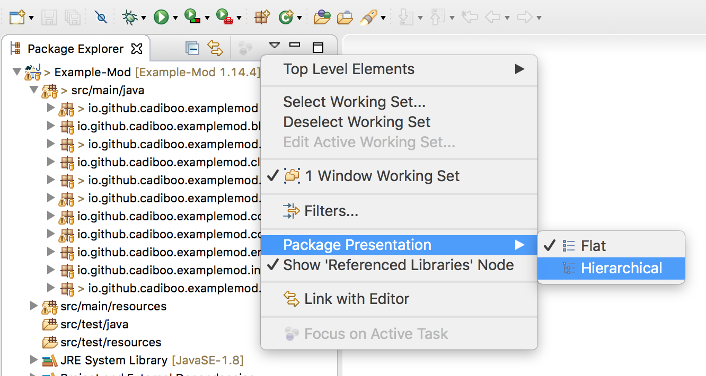  
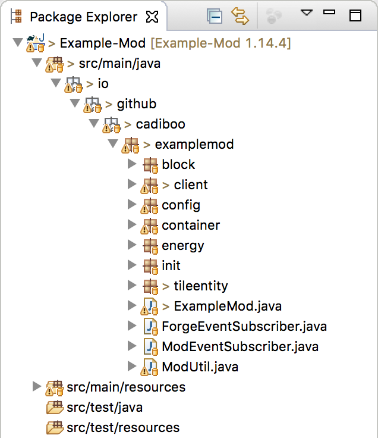  

# Troubleshooting
When asking for help make sure to include your console log.  
  

#### If your run configs fail to generate:  
First try closing eclipse, then running `gradlew genEclipseRuns` from the command line, then opening eclipse back up.  
If this doesn't work **but the `.launch` files generate in your mod's folder properly**, try importing them manually.  
Do this by going to `File > Import > Launch Configurations`, selecting your mods folder and importing all run configs from there.  
Before:  
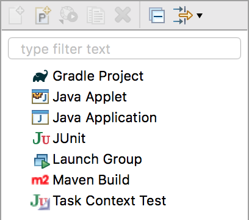  
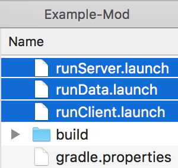  
After:  
  
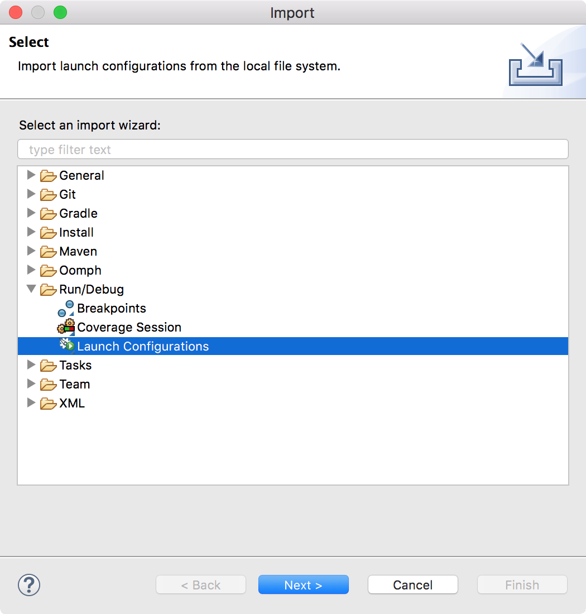  
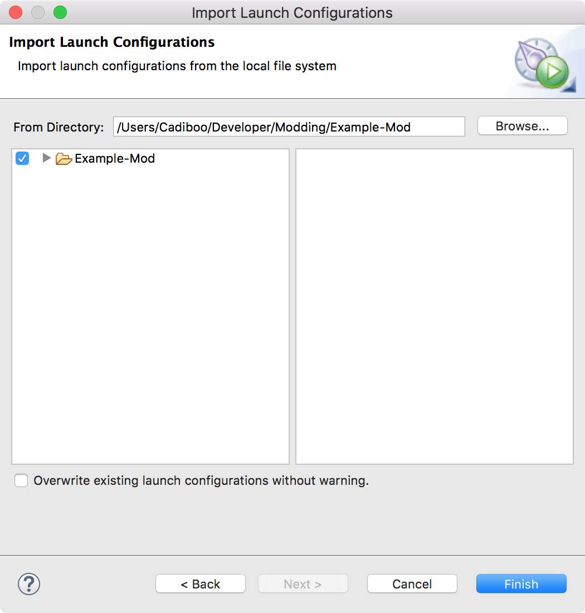  
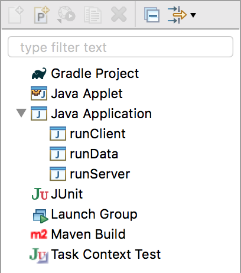  

##### [1.2 - Basic Mod](../../1.2-basic-mod)
