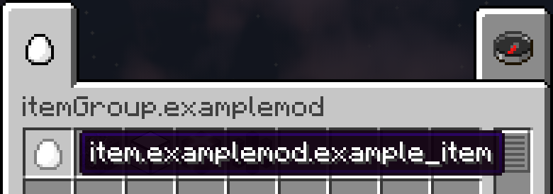
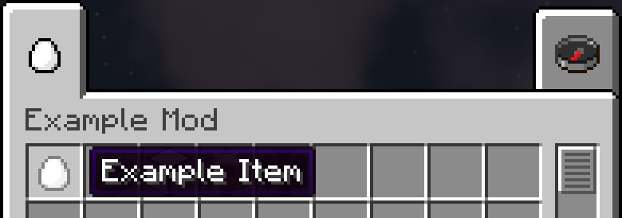

This tutorial assumes you have already
- Read the [Pre-requisites](/tutorials/Pre-requisites)
- Downloaded the latest Forge MDK
- Setup your mod folder as described at the top of [the main Forge 1.14.4 tutorials page](/tutorials/1.14.4/forge/)
- Read and followed [1.0 - Gradle Configuration](../1.0-gradle-configuration/)
- Read and followed [1.1 - Importing the project into your IDE](../1.1-importing-project/)
- Read and followed [1.2 - Basic Mod](../1.2-basic-mod/)
- Read and followed [1.3 - Doing Something](../1.3-doing-something/)
- Read and followed [1.4 - Proxies](../1.4-proxies/)
- Read and followed [1.5 - First Item](../1.5-first-item/)
- Read and followed [1.6 - Item Model](../1.6-item-model/)
- Read and followed [1.7 - ItemGroup](../1.7-itemgroup/)

You've probably noticed by now that both our example item or our mod's `ItemGroup` have weird names.

This is because we don't have any localisations for our objects yet.
> Localisation/Internationalisation
> Users from multiple different areas will use our mod so we need to be able to provide different names for our objects in different languages. Localisation files allow us to do this by specifying translations that the game uses to map the Translation Keys of our objects to translated text. 
> [Read](https://en.wikipedia.org/wiki/Internationalization_and_localization) [much](https://en.wikipedia.org/wiki/Language_localisation) [more](https://en.wikipedia.org/wiki/Video_game_localization)

A localisation file (or ".lang" file on older versions) provides translations for a specific language. We're going to add some translations for our objects. Localisation files are named after the ISO language code for their language. The default language is American English which has the code "en_us". Find other language codes [here](https://www.andiamo.co.uk/resources/iso-language-codes/).  

Create a new file called "en_us.json" at `src/main/resources/assets/examplemod/lang/` and paste the following text into it
```json
{
	"item.examplemod.example_item": "Example Item",
	"itemGroup.examplemod": "Example Mod"
}

```
Each line is a key->value pairing where the key is the Translation Key of one of our objects and the value is the translated name for the object.



##### [1.9 - First Block](./1.9-first-block)
