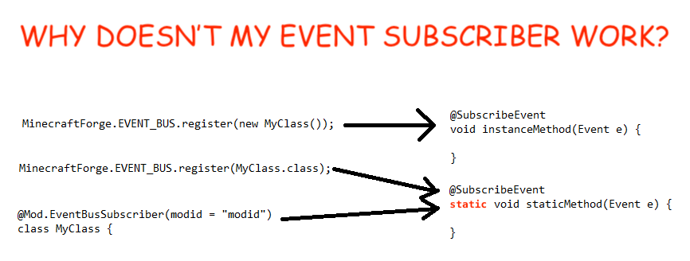

This tutorial assumes you have already
- Read the [Pre-requisites](/tutorials/Pre-requisites)
- Downloaded the latest Forge MDK
- Setup your mod folder as described at the top of [the main Forge 1.14.4 tutorials page](/tutorials/1.14.4/forge/)
- Read and followed [1.0 - Gradle Configuration](../1.0-gradle-configuration/)
- Read and followed [1.1 - Importing the project into your IDE](../1.1-importing-project/)
- Read and followed [1.2 - Basic Mod](../1.2-basic-mod/)
- Read and followed [1.3 - Doing Something](../1.3-doing-something/)
- Read and followed [1.4 - Proxies](../1.4-proxies/)
- Read and followed [1.5 - First Item](../1.5-first-item/)
- Read and followed [1.6 - Item Model](../1.6-item-model/)
- Read and followed [1.7 - ItemGroup](../1.7-itemgroup/)
- Read and followed [1.8 - Localisation](../1.8-localisation/)

In this tutorial we're going to add a new block to the game.  

To start off, go to your `ModEventSubscriber` and create a `public static void` method called `onRegisterBlocks` with a `RegistryEvent.Register<Block>` as its only parameter. Next, annotate the method with `@SubscribeEvent`. 
Your method should look something like
```java
@SubscribeEvent
public static void onRegisterBlocks(RegistryEvent.Register<Block> event) {

}
```

Now go inside the `onRegisterBlocks` event subscriber method and add a call to the event's registry's `registerAll` method with `event.getRegistry().registerAll();`. Inside the final brackets (The ones that invoke `registerAll`) make 2 new lines and create a new `Block` with `new Block(Block.Properties.create(Material.ROCK).hardnessAndResistance(3.0F, 3.0F))`. This simply creates a new `Block` with the `ROCK` material, a hardness of 3 and a resistance of 3 (very similar to iron ore), but we need to also set its **registry name**. Do this by passing the new `Block` as the first parameter of a call to the `setup` method, and the `String` `"example_ore"` as the second parameter.  
All this combined should look like
```java
event.getRegistry().registerAll(
	setup(new Block(Block.Properties.create(Material.ROCK).hardnessAndResistance(3.0F, 3.0F)), "example_ore")
);
```
Now run the game and you should be able to put your block in the world with `/setblock`. **Your block won't have an item counterpart, a model or do anything yet though.**  

If you run into issues please make sure you look at the following image before asking for help. (Make sure you've annotated your method with `@SubscribeEvent`, that the method is a `public static void` and that the method has a single parameter (The class of the parameter must extend `net.minecraftforge.eventbus.api.Event`))  



##### [1.10 - BlockItem](../1.10-blockitem)
